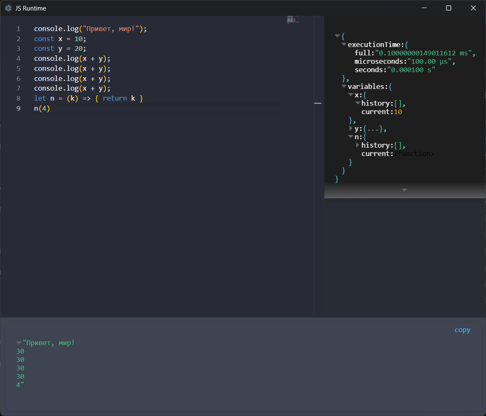

# JS Play (Electron + Vite + Vue)



### Description
JS Play is a desktop application for working with JavaScript code. It’s similar to a browser DevTools console: edit and run code, inspect output and execution time, analyze the AST, and track variable value changes and current global state with clear visualization.

## Stack
- Electron ^34 (electron-forge)
- Vite ^5
- Vue ^3
- Monaco Editor
- Esprima / Escodegen
- vue-json-viewer
- Prism.js / highlight.js

## Requirements
- Node.js LTS (from v19.0.0 )
- npm ( from 8.19.2 )

## Installation
```bash
npm install
```

## Scripts
- Start in dev mode:
```bash
npm run start
```

- Package the app:
```bash
npm run package
```

- Make installer/distributable:
```bash
npm run make
```

- Publish (if configured):
```bash
npm run publish
```

- Lint (stub):
```bash
npm run lint
```

## What’s inside
- `Monaco` for code editing.
- AST parsing (`esprima`), expression generation/evaluation (`escodegen`).
- `console.log` capture and formatting, execution time measurement.
- Global state and variable change history visualization via `vue-json-viewer`.
- Ready for desktop packaging